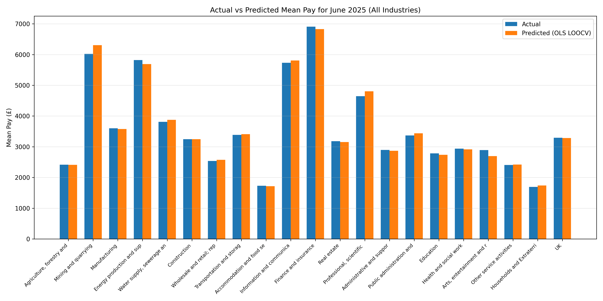
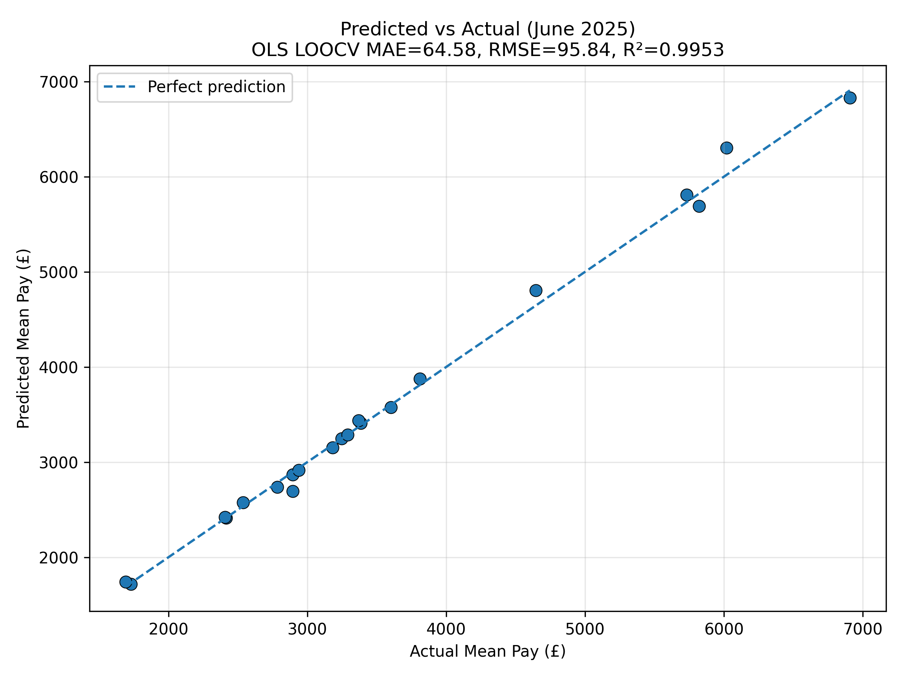
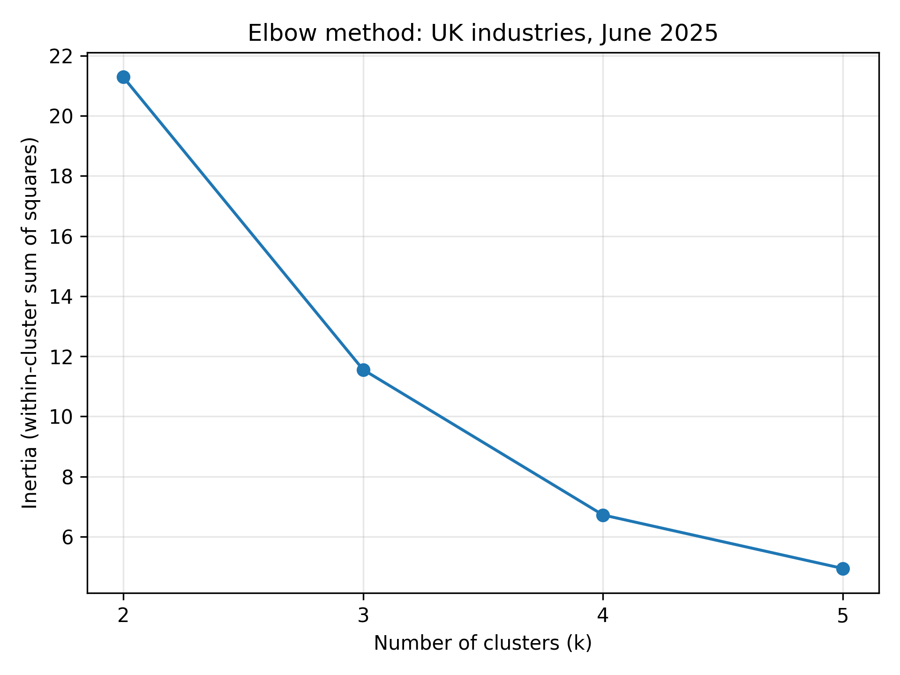
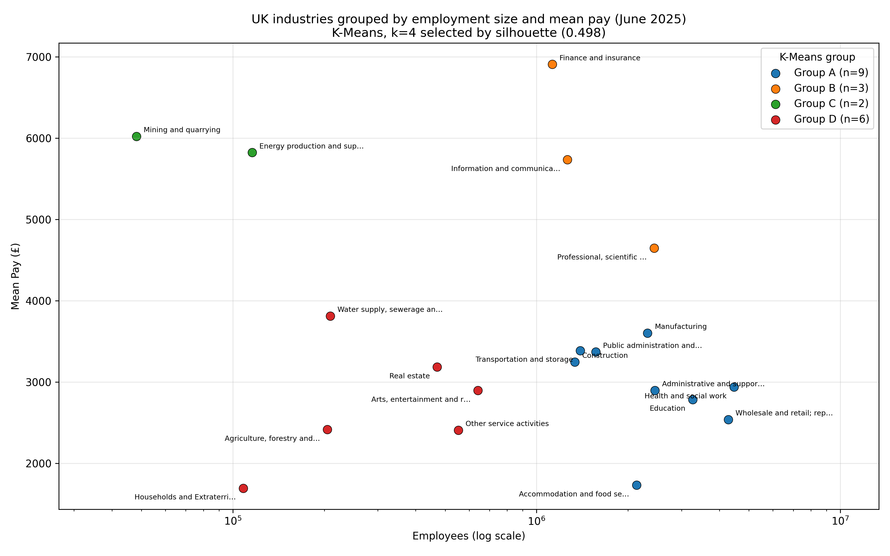

# UK PAYE Mean Pay — Cross-Sectional Prediction & Industry Segmentation

A small, reproducible Python project built on UK PAYE Real Time Information (RTI) data. It contains two independent analyses: a supervised model that predicts June 2025 mean pay for a held-out industry, and an unsupervised K-Means segmentation that groups industries by employment size and pay level.

The emphasis is on careful evaluation design — baselines, leakage-aware preprocessing, and honest reporting of what small-sample results can and cannot show.

---

## What this project does

### 1. Cross-sectional prediction of June 2025 mean pay

- **Samples:** industries (rows). **Features:** months (columns).
- **Features:** the twelve monthly mean-pay values from **June 2024 to May 2025**.
- **Target:** **June 2025** mean pay.
- **Evaluation:** leave-one-out cross-validation that holds out **an industry**, never a future time period.

Because the held-out dimension is the industry rather than time, this is a **cross-sectional prediction exercise that uses temporal features** — not a rolling time-series backtest. June 2025 is already present in the source data; the question being asked is whether an industry's recent pay trajectory, combined with patterns learned from other industries, identifies its June value.

### 2. Cross-industry segmentation (K-Means)

- **Snapshot:** June 2025, the latest month present in both source sheets.
- **Observation:** one industry.
- **Features:** `log10(Employees)` and mean pay (£).
- Groups industries by employment size and pay level, with k chosen by silhouette score.

---

## Results

### Prediction — leave-one-out cross-validation

| Model | MAE (£) | RMSE (£) | R² |
|---|---:|---:|---:|
| OLS | 64.58 | 95.84 | 0.9953 |
| Persistence baseline (June ≈ May) | 66.86 | 117.20 | 0.9930 |
| Ridge | 108.68 | 182.12 | 0.9830 |

LOOCV runs across 21 rows — 20 industries plus the UK aggregate series. Ridge is fitted in a pipeline whose `StandardScaler` is refitted **inside each training fold**, so the held-out industry contributes nothing to the scaling statistics.

**How to read these numbers.** The R² values are high, but they should not be read as extraordinary predictive power, and R² is not accuracy. Mean pay varies enormously *between* industries (June 2025 spans £1,693 to £6,907, standard deviation ≈ £1,399), while the month-to-month movement being predicted is small — the average absolute change from May to June is about £67, roughly 5% of the between-industry spread. R² is measured against that large between-industry variance, so any model that roughly locates an industry's pay level scores above 0.99.

The clearest evidence is the baseline itself: simply carrying May's value forward reaches R² = 0.9930 with an MAE of £66.86. OLS improves on that only modestly, reducing MAE to £64.58. Ridge, with its default `alpha=1.0`, is over-regularised for this problem and performs worst of the three under LOOCV. With 21 rows, all of these differences rest on a small sample and should be treated as indicative rather than settled.

### Segmentation — silhouette scores

| k | 2 | 3 | 4 | 5 |
|---|---:|---:|---:|---:|
| Silhouette | 0.491 | 0.451 | **0.498** | 0.445 |

**Selected: k = 4, silhouette ≈ 0.498.** This indicates *moderate* separation, not strongly distinct clusters — k=2 is close behind at 0.491, so the choice is not decisive. The four groups (labelled A–D, with no ordering implied) are:

| Group | n | Description |
|---|---:|---|
| A | 9 | Large employers with mid-range pay — Manufacturing, Construction, Wholesale and retail, Transportation, Accommodation and food, Administrative services, Public administration, Education, Health and social work |
| B | 3 | Large, high-pay knowledge-intensive sectors — Finance and insurance, Information and communication, Professional/scientific/technical |
| C | 2 | Very small, high-pay sectors — Mining and quarrying, Energy production and supply |
| D | 6 | Smaller employers across a similar pay range — Agriculture, Water supply, Real estate, Arts and recreation, Other services, Households and Extraterritorial |

These are descriptive groupings from one dataset and one monthly snapshot, not universal economic categories.

---

## Visualisations

**Actual vs predicted June 2025 mean pay, per industry (OLS under LOOCV)**



**Predicted vs actual, against the line of perfect prediction**



**Elbow curve for the cross-industry clustering, k = 2 to 5**



**UK industries grouped by employment size and mean pay, June 2025**



---

## Method

### Data

UK PAYE RTI statistics supplied as an Excel workbook with two sheets, read by name:

- `"Employees (Industry)"` — monthly payrolled employee counts, July 2014 to July 2025
- `"Mean Pay (industry)"` — monthly mean pay, July 2014 to June 2025

Each sheet carries several metadata rows above the real header, which sits on row 6 and includes a `Date` column. Both sheets contain the same 21 series: 20 industries plus a UK total.

**The dataset is intentionally not redistributed in this repository.** See `data/README.md` for how to supply it.

### Preprocessing

Shared steps (`src/preprocessing.py`, `src/utils.py`): the in-sheet header is located, metadata rows and fully empty columns are dropped, date strings are normalised and parsed, and every date is aligned to the start of its month.

For the prediction task (`src/models/forecasting.py`): two non-numeric survey columns are removed, all industry columns are coerced to numeric, and the industries × months matrix is linearly interpolated along the time axis, with forward and backward fill for any remaining edge gaps. This matters because the Mean Pay sheet has 22 missing cells scattered across its eleven-year history.

For the segmentation task (`src/models/clustering.py`): the two sheets are joined **on `Date`** rather than by row position — they do not cover the same number of months — and the latest shared month is selected. The June 2025 snapshot is complete, so no imputation is applied; missing or non-positive values raise an explicit error instead.

### Models and evaluation

**Prediction.** OLS is implemented directly with `numpy.linalg.lstsq` inside a manual LOOCV loop. The persistence baseline predicts June from the May value. Ridge (`alpha=1.0`) runs in a `Pipeline` with `StandardScaler` refitted per fold. All three are scored on MAE, RMSE, and R².

**Segmentation.** The UK aggregate row is excluded: its employee count is the exact sum of the 20 industry counts, making it a deterministic total rather than a comparable observation. Households and Extraterritorial is retained, as it is an official PAYE category. That leaves **20 industries**. Features are standardised with `StandardScaler`, then K-Means is fitted for k = 2, 3, 4, 5 with `random_state=42` and `n_init=10`, and k is selected by maximum silhouette score.

---

## Quickstart

Requires **Python 3.10+**.

```bash
git clone https://github.com/dnperak999-arch/paye-mean-pay-forecasting.git
cd paye-mean-pay-forecasting

python -m venv .venv
source .venv/bin/activate        # macOS / Linux
# .venv\Scripts\activate         # Windows

pip install -r requirements.txt
```

Place the PAYE RTI workbook inside `data/` before running — see `data/README.md` for the required sheet names and layout. `main.py` uses any `.xlsx` file it finds there.

```bash
python main.py
```

This prints the evaluation metrics and cluster membership to the console and regenerates all four figures in `figures/`.

---

## Repository structure

```text
paye-mean-pay-forecasting/
├─ .gitignore
├─ README.md
├─ main.py                          # entry point: runs both analyses
├─ pyproject.toml
├─ requirements.txt
├─ data/
│  ├─ README.md                     # how to supply the dataset
│  └─ dataset.xlsx                  # local only, not committed
├─ figures/
│  ├─ mean_pay_forecast_bar.png
│  ├─ mean_pay_forecast_scatter.png
│  ├─ kmeans_elbow.png
│  └─ industry_clusters.png
└─ src/
   ├─ preprocessing.py              # sheet loading and cleaning
   ├─ utils.py                      # paths and shared helpers
   └─ models/
      ├─ forecasting.py             # OLS, baseline, Ridge, LOOCV
      └─ clustering.py              # cross-industry K-Means
```

---

## Limitations and interpretation

**Sample size.** Twenty-one rows and twelve features is a demanding ratio. Every conclusion here is small-sample and should be read as indicative.

**This is not a temporal backtest.** Holding out an industry tests whether the relationship generalises across sectors. It says nothing about predicting a month that has not yet occurred.

**R² is inflated by the structure of the data,** for the reason set out in the Results section: between-industry variation dwarfs month-to-month variation. The persistence baseline is the honest yardstick, and it is hard to beat.

**Single train/test split (sanity check).** Alongside LOOCV, the project runs one 70/30 split across industries — 14 training rows, **7 test industries**, `random_state=42`:

| Model | MAE (£) | RMSE (£) | R² |
|---|---:|---:|---:|
| OLS | 612.12 | 780.98 | 0.6117 |
| Ridge | 123.35 | 210.86 | 0.9717 |
| Persistence baseline | 51.43 | 92.81 | 0.9945 |

This is a single split of seven industries and is **not** a reliable performance estimate. It is included because the sharp deterioration in OLS is informative: fitting twelve features on fourteen rows produces an unstable solution, and regularisation happens to help on this particular split. That does not make Ridge the better model in general — it ranked last under LOOCV. What both evaluations agree on is that the persistence baseline remains competitive, which is the most important result in the project.

**Clustering separation is moderate.** A silhouette of 0.498 describes loosely separated groups, and with 20 industries the smallest groups contain only two or three members. The `log10` transform on employee counts prevents the largest employers from dominating the distance metric.

---

## Skills demonstrated

- Python data pipelines with a clear module structure
- pandas and NumPy for messy real-world spreadsheet ingestion
- scikit-learn: regression, K-Means, pipelines, standardisation
- Cross-validation and baseline-first model comparison
- Leakage-aware preprocessing (scaler refitted inside each fold)
- Unsupervised learning with quantitative cluster selection
- Model evaluation and honest interpretation of metrics
- Data visualisation with Matplotlib
- Reproducible, script-driven project layout
